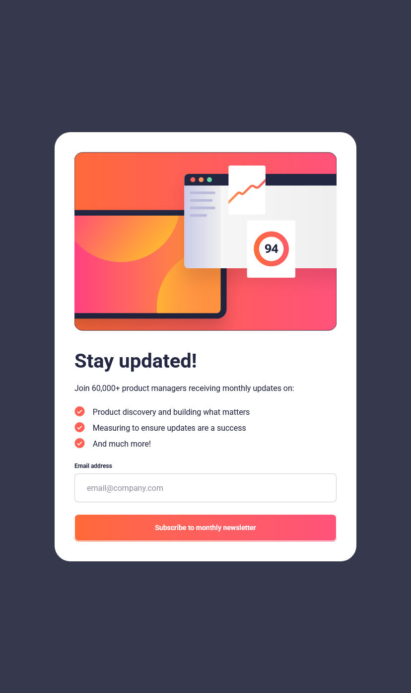

# Frontend Mentor - Newsletter sign-up form with success message

This is a solution to the [Newsletter sign-up form with success message](https://www.frontendmentor.io/challenges/). Frontend Mentor challenges help you improve your coding skills by building realistic projects. 

## Table of contents

- [Overview](#overview)
  - [The challenge](#the-challenge)
  - [Screenshot](#screenshot)
  - [Links](#links)
- [My process](#my-process)
  - [Built with](#built-with)
  - [What I learned](#what-i-learned)
  - [Useful resources](#useful-resources)

## Overview

### The challenge

Users should be able to:

- View the optimal layout depending on their device's screen size
- See hover states for interactive elements

### Screenshot

Here is a screenshot of the mobile solution:

--

Here is a screenshot of the tablet solution with the active button:

--

Here is a screenshot of the desktop solution with the error state:

--
Here is a screenshot of the success page:

--

### Links

- Solution URL: [Frontend Mentor](https://www.frontendmentor.io/solutions/meet-landing-page-2cqRWvWRfb)
- Live Site URL: [Vercel.com](https://newsletter-sign-up-form-mocha.vercel.app/)

## My process

### Built with

- Semantic HTML5 markup
- Tailwind
- Flexbox
- CSS Grid
- Mobile-first workflow
- JavaScript

### What I learned

This challenge took me quite some time to finish 😅, but I’m really proud of the progress I made! Here are the main things I learned:

#### Tailwind CSS

- I discovered how to use Tailwind for styling, since I already have a solid understanding of CSS, it was easier to get started.

- The main difficulty I faced was responsive design. As a beginner, it felt a bit tricky, but I learned a lot about handling breakpoints.

- One drawback I noticed: with long class lists, the code can become less readable compared to traditional CSS.

#### JavaScript

This is my second project using JavaScript:
- I learned how to get values from a form using .value.

- I practiced changing styles dynamically from JS.

- I got familiar with useful functions and methods such as: `classList.replace()` , `checkValidity()` , `form.reset()` ...etc;

### Useful resources

- [ChatGPT (OpenAI)](https://chatgpt.com/) - This helped me understand how different CSS properties work together, especially layout behavior and default styles. I used it as a coding assistant whenever I had a doubt.
- [Tailwind CSS Documentation](https://tailwindcss.com/) - The official documentation was a great resource for me while working on this project. I really liked how well-structured it is, with clear examples for each utility class. It helped me understand how to quickly apply styles and manage responsive design using Tailwind.
- [W3Schools](https://www.w3schools.com) - I used this site a lot to review syntax, explore new CSS properties, and test small snippets of code. It's really helpful for quick references and hands-on practice while learning.